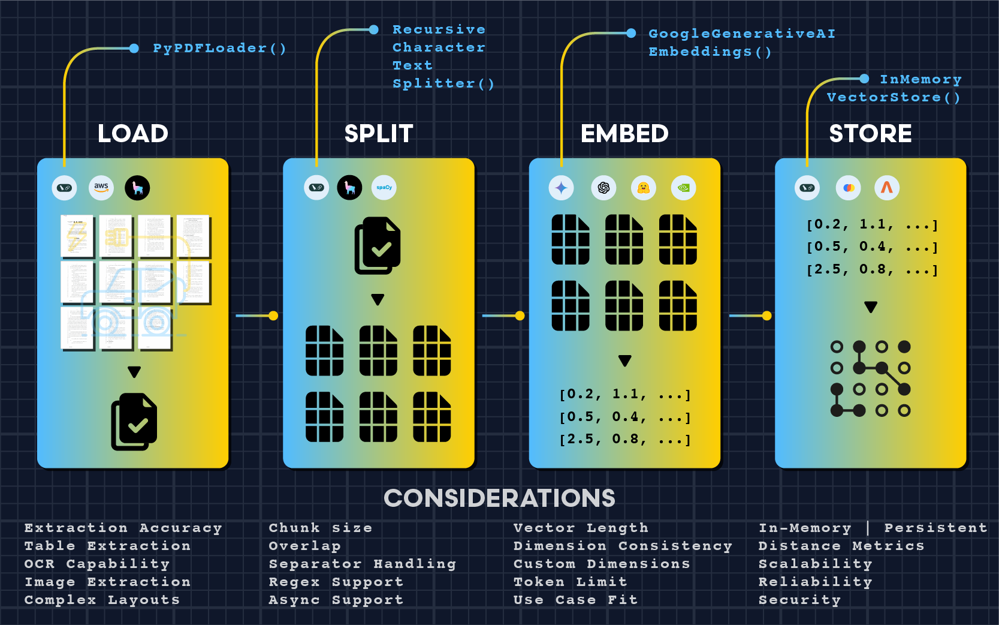
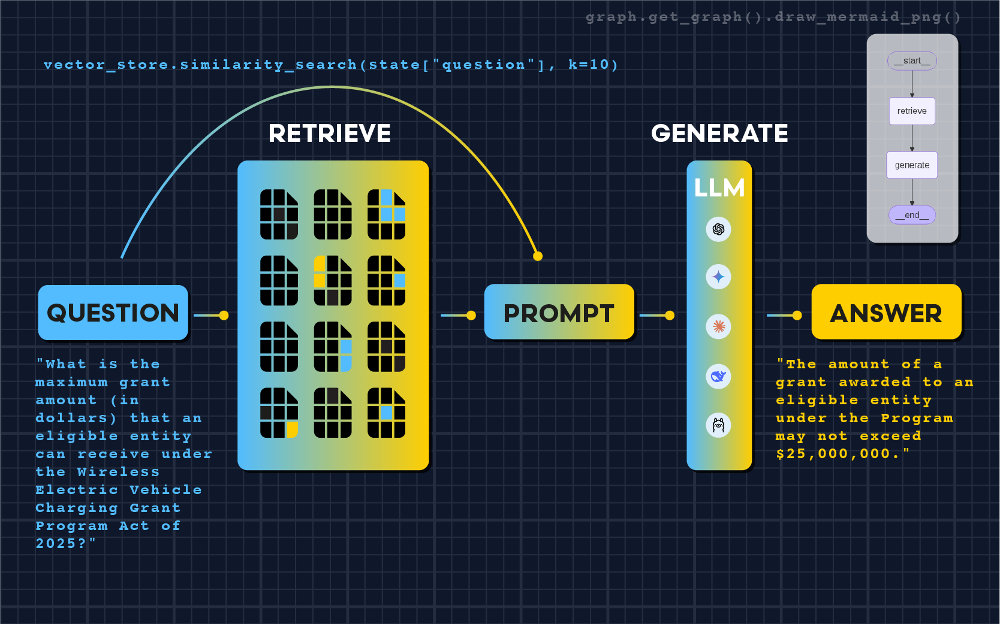

# Retrieval Augmented Generation (RAG) with LangChain 🦜🔗

**Building an AI Legal Agent to Parse Complex Legislation**



This project demonstrates how to build a Retrieval Augmented Generation (RAG) system using LangChain that can intelligently query PDF documents. We'll create an AI agent capable of answering specific questions about the "Wireless Electric Vehicle Charging Grant Program Act of 2025" by combining document retrieval with large language model reasoning.

## 🚀 Features

- **PDF Document Loading**: Automated parsing of legal documents with metadata preservation
- **Semantic Text Splitting**: Smart chunking at legal section boundaries (SEC.) for better context
- **Vector Embeddings**: High-dimensional semantic representations using Google's embedding models
- **Similarity Search**: Intelligent retrieval with configurable k-values for optimal coverage
- **Custom Prompting**: Precise legal-focused prompts that emphasize factual accuracy
- **LangGraph Workflow**: Clean separation of retrieval and generation steps
- **Legal Precision**: Exact quotation extraction with artifact cleaning

## 📋 Prerequisites

- Python 3.12+
- Google AI API key (for Gemini models and embeddings)
- Virtual environment manager (uv, conda, or venv)

## 🛠️ Installation

1. **Clone the repository:**
```bash
git clone https://github.com/yauheniya-ai/langchain-rag
cd langchain-rag
```

2. **Create virtual environment:**
```bash
# Using uv (recommended)
uv venv --python=3.12
```

3. **Install dependencies:**
```bash
# Using uv
uv pip install -r requirements.txt

```

4. **Set up environment variables:**
```bash
# Create .env file and add your API keys
LANGCHAIN_KEY=""
GOOGLE_API_KEY=""
```

## 📁 Project Structure

```
langchain-rag/
├── assets/                            # Images and charts
├── data/
│   ├── input/
│   │   └── BILLS-119hr1892ih.pdf      # Legal document
│   └── output/
│       └── langgraph.png              # Generated workflow diagram
├── langchain-rag.ipynb                # Main RAG implementation
├── requirements.txt                   # Python dependencies
├── .env                               # Environment variables
├── .gitignore                         # Protect sensitive files
├── LICENSE                            # Project license
└── README.md                          # This file
```

## 🔧 Usage

### Basic RAG Pipeline

The core RAG implementation follows a four-step preprocessing pipeline:

1. **Load**: Parse PDF with metadata preservation
2. **Split**: Chunk text at semantic boundaries (legal sections)
3. **Embed**: Convert text to 768-dimensional vectors
4. **Store**: Index embeddings in vector database

## 🎯 Key Design Decisions

### Semantic Chunking
We split documents at legal section boundaries (`SEC.`) rather than arbitrary character limits. This preserves the logical structure of legal documents and improves retrieval accuracy.

### Retrieval Configuration
- **k=10**: Retrieves ~10,000 characters of context (vs default k=4)
- **Chunk overlap**: 200 characters to maintain context continuity
- **Custom prompting**: Emphasizes exact quotation and artifact cleaning



### Model Selection
- **Embeddings**: Google's `embedding-001` (768 dimensions)
- **LLM**: Gemini 2.0 Flash for fast, accurate generation
- **Storage**: InMemoryVectorStore for development (consider persistent stores for production)

## 📊 Performance Results

Our RAG system achieves high precision on legal document queries:

| Question Type | Accuracy | Response Style |
|---------------|----------|----------------|
| Dollar amounts | 100% | Exact quotation |
| Percentages | 100% | Precise extraction |
| Legal citations | 100% | Complete references |
| Policy details | 100% | Factual accuracy |

Sample results:
- Question: What is the maximum grant amount (in dollars) that an eligible entity can receive under the Wireless Electric Vehicle Charging Grant Program Act of 2025?
- Answer: "The amount of a grant awarded to an eligible entity under the Program may not exceed $25,000,000."


## 🔍 Advanced Features

### LangGraph Workflow
The system uses LangGraph to create a clean, debuggable pipeline:
- **Retrieve step**: Similarity search with configurable k
- **Generate step**: LLM reasoning with custom prompts
- **State management**: Type-safe data flow between steps

### Custom Prompting
Our prompt template emphasizes:
- Using only provided context
- Exact quotation from source
- Cleaning PDF artifacts (line numbers, formatting)
- Explicit "Not in context" responses when information is unavailable

## 🚧 Limitations & Future Work

- **In-memory storage**: Consider persistent vector databases for production
- **Single document**: Extend to multi-document legal research
- **Re-ranking**: Add semantic re-ranking for improved precision
- **Query expansion**: Handle complex multi-part legal questions

## 🤝 Contributing

1. Fork the repository
2. Create a feature branch (`git checkout -b feature/amazing-feature`)
3. Commit your changes (`git commit -m 'Add amazing feature'`)
4. Push to the branch (`git push origin feature/amazing-feature`)
5. Open a Pull Request

## 📝 License

This project is licensed under the MIT License - see the LICENSE file for details.

## 🔗 Learn More

For a detailed walkthrough of this implementation, check out the full Medium article:

**[Retrieval Augmented Generation (RAG) with LangChain](https://medium.com/@yauheniya.ai/retrieval-augmented-generation-rag-with-langchain-bd79ad08d750)**
