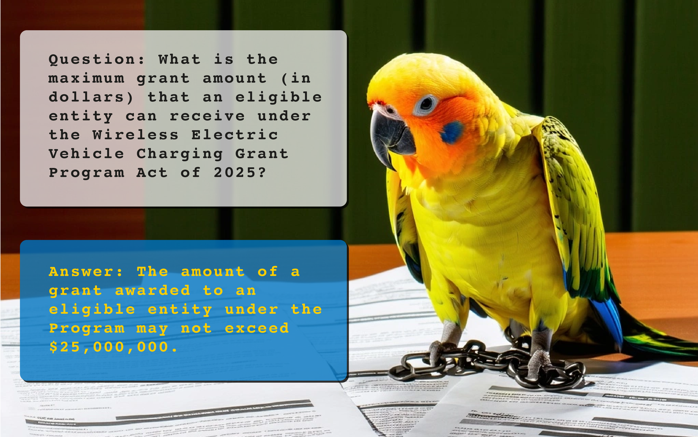
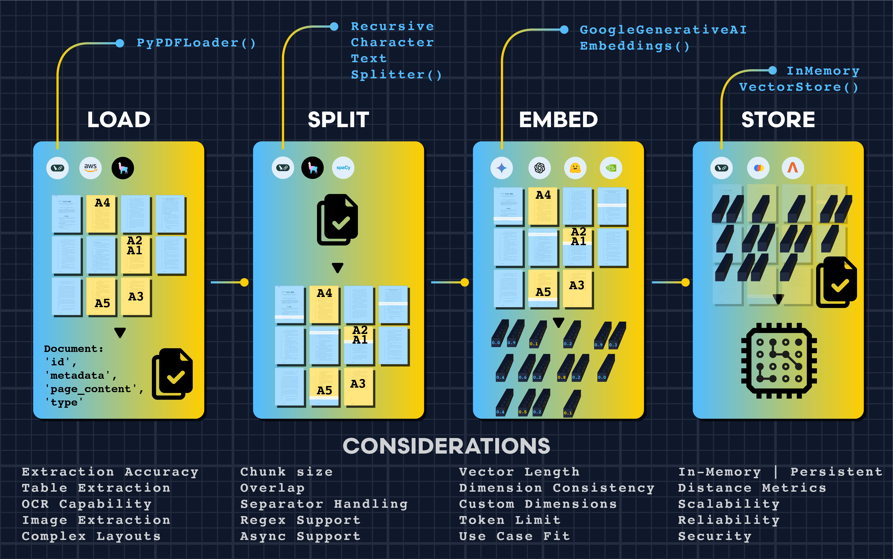
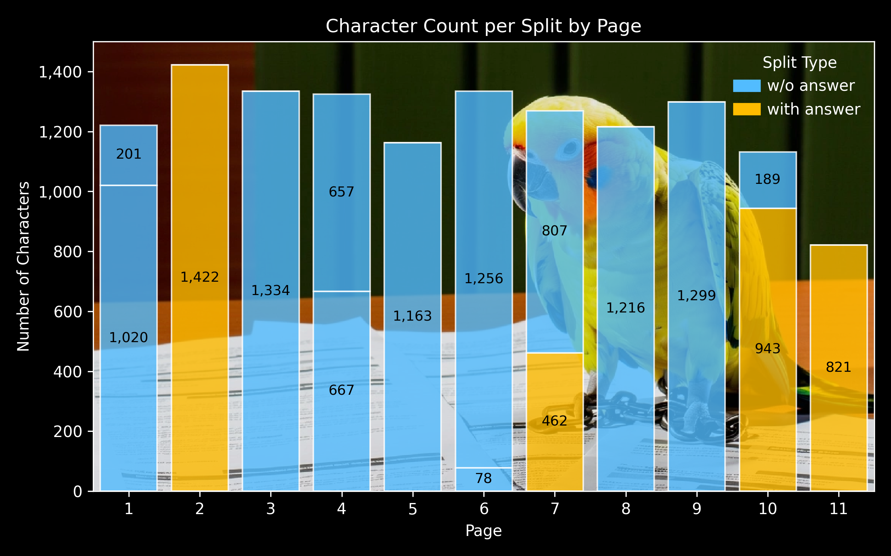
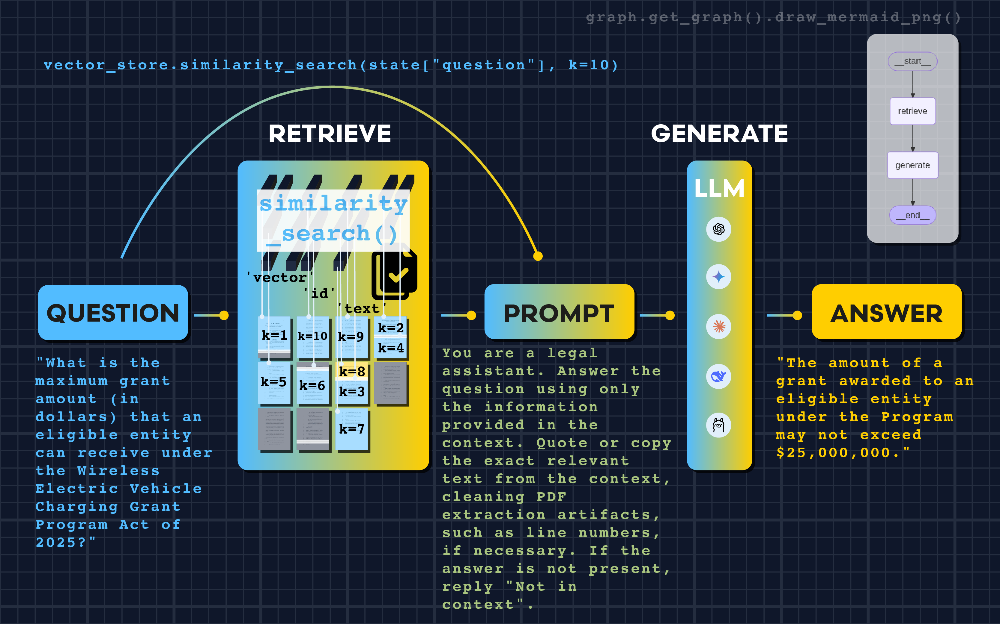

# Retrieval Augmented Generation (RAG) with LangChain 🦜🔗

**Building an AI Legal Agent to Parse Complex Legislation**

<figure>
  
  <figcaption style="text-align: center; font-style: italic;">Querying Legal Documents with LangChain</figcaption>
</figure>

This project demonstrates how to build a Retrieval Augmented Generation (RAG) system using LangChain that can intelligently query PDF documents. We'll create an AI agent capable of answering specific questions about the "Wireless Electric Vehicle Charging Grant Program Act of 2025" by combining document retrieval with large language model reasoning.

## 🚀 Features

- **PDF Document Loading**: Automated parsing of legal documents with metadata preservation
- **Semantic Text Splitting**: Smart chunking at legal section boundaries (SEC.) for better context
- **Vector Embeddings**: High-dimensional semantic representations using Google's embedding models
- **Similarity Search**: Intelligent retrieval with configurable k-values for optimal coverage
- **Custom Prompting**: Precise legal-focused prompts that emphasize factual accuracy
- **LangGraph Workflow**: Clean separation of retrieval and generation steps
- **Legal Precision**: Exact quotation extraction with artifact cleaning

## 📋 Prerequisites

- Python 3.12+
- Google AI API key (for LLM and embeddings)
- Virtual environment manager (e.g. uv)

## 🛠️ Installation

1. **Clone the repository:**
```bash
git clone https://github.com/yauheniya-ai/langchain-rag
cd langchain-rag
```

2. **Create virtual environment and activate as instructed:**
```bash
# Using uv (recommended)
uv venv --python=3.12
```

3. **Install dependencies:**
```bash
# Using uv
uv pip install -r requirements.txt

```

4. **Set up environment variables:**
```bash
# Rename .env.sample to .env and add your API keys
LANGCHAIN_KEY=""
GOOGLE_API_KEY=""
```

## 📁 Project Structure

```
langchain-rag/
├── assets/                            # Images
├── data/
│   ├── input/
│   │   └── BILLS-119hr1892ih.pdf      # Legal document
│   └── output/                        # Generated files            
├── langchain-rag.ipynb                # Main RAG implementation
├── requirements.txt                   # Python dependencies
├── .env                               # Environment variables
├── .gitignore                         # Protect sensitive files
├── LICENSE                            # Project license
└── README.md                          # This file
```

## 🔧 Usage

### Basic RAG Pipeline

<figure>
  
  <figcaption style="text-align: center; font-style: italic;">The RAG Preprocessing Pipeline</figcaption>
</figure>

The RAG implementation follows a four-step preprocessing pipeline:

1. **Load**: Parse PDF with metadata preservation
2. **Split**: Chunk text at semantic boundaries (legal sections)

<figure>
  
  <figcaption style="text-align: center; font-style: italic;">Visualization of the Split</figcaption>
</figure>

3. **Embed**: Convert text to 768-dimensional vectors
4. **Store**: Index embeddings in vector database

### Retrieval Configuration


<figure>
  
  <figcaption style="text-align: center; font-style: italic;">The LangGraph RAG Pipeline</figcaption>
</figure>


- `k=10`: Retrieves 10 chunks of context vs. default `k=4`
- **Custom prompting**: Emphasizes exact quotation and artifact cleaning

### Model Selection
- **Embeddings**: Google's `embedding-001` (768 dimensions)
- **LLM**: Gemini 2.0 Flash for fast, accurate generation
- **Storage**: InMemoryVectorStore for development (consider persistent stores for production)

## 📊 Performance Results

Our RAG system achieves high precision on legal document queries:

| Question Type | Accuracy | Response Style |
|---------------|----------|----------------|
| Dollar amounts | 100% | Exact quotation |
| Percentages | 100% | Precise extraction |
| Policy details | 100% | Factual accuracy |

Sample results:
- Question: What is the maximum grant amount (in dollars) that an eligible entity can receive under the Wireless Electric Vehicle Charging Grant Program Act of 2025?
- Answer: "The amount of a grant awarded to an eligible entity under the Program may not exceed $25,000,000."

## 📝 License

This project is licensed under the MIT License - see the LICENSE file for details.

## 📚 Read More

For a detailed walkthrough of this implementation, check out the full Medium article:

**[Retrieval Augmented Generation (RAG) with LangChain](https://medium.com/@yauheniya.ai/retrieval-augmented-generation-rag-with-langchain-bd79ad08d750)**

## 🔗 Refences 

LangChain. [Build a Retrieval Augmented Generation (RAG) App: Part 1.](https://python.langchain.com/docs/tutorials/rag/) 

LangChain. [Build a semantic search engine.](https://python.langchain.com/docs/tutorials/retrievers/) 

